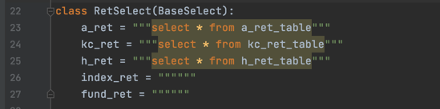

#代码规范:

###import模块:

import内容依次是
1. Python内部模块
2. 三方包(如果可以，尽量少用三方包，因为会有依赖)
3. 依次从./中的config.py, const.py, data_transform.py, util.py, query.py中导入所需模块
4. ./template/*.py
5. ./engine/*.py
6. ./cronjob/*.py
7. ./port/*.py

按照顺序import 每一点写完后空一行

###基础类:

如果后续需要继承，基础类应以Base为开头命名，如BaseSelect, BaseProcess

基础类只实现基础功能，上层中写到有可能在其他地方需要的功能应当移到更加基础的文件或类中，尽量避免出现相互引用的混乱情况，最终的代码应当形成树状结构，
即底层类、中间类、上层类，定时任务或接口文件的多层结构，每一层只从上一层中引用所需类。

其中，基础类中:
1. BaseSelect实现的是get_dates(定时任务的日期获取方法)，get_data(数据统一获取形式)，complete_df(补充完整dataframe的列)
2. BaseProcess中目前只有一个方法，就是滚动模型方法，这里可以用于滚动收益率计算、tm模型等
3. ConfData主要只实现数据连接，数据保存
4. const.py中的NameConst和Schema类分别确定字段命名和字段类型
5. DataTransform目前专注于透视表转换、重命名、清除数据、数据合并等功能，目前暂可视为dataframe的子类，和dataframe处理类似

###template类:
目前实现了收益与风险类、持仓分析、收益归因类、情景分析类、标签类的计算内容，主要框架已形成，引用的代码规范可见engine

这部分内容统一用类来写，一方面形成一个良好的维护结构，一方面意义很明显。主要的类有:
1. RetAttr: 入参是持仓和计算时间，可以实现get_style(获取风格数据)，fill_portfolio(填充持仓数据)，get_stock_ret(获取价格数据)，
   get_daily_attr(收益归因日度计算结果)，get_daily_style(持仓分析日度计算结果)，get_cum_attr(收益归因展示)
2. 


###engine类:
这部分中有template模块使用方法:
1. ret_attribution.py中，cal_ret_attr_data用于多处收益归因的计算，同时cal_barra_attr_data和cal_brinson_attr_data
   是对RetAttr的个性化使用方法案例。
2. 

###cronjob和port类就相对比较简单，略去


#使用文档
##基础模块
1. 数据连接和保存: 
```python
from config import ConfData
# 数据连接
conn = ConfData.get_conn(schema)

# 数据保存, columns是所需要保存的字段
ConfData.save(df, 'schema_name.table_name', columns)
```
或者也可以直接写SQL并获取: 在query.py下添加SQL



获取数据即可为:
```python
from query import RetSelect
df = RetSelect.get_data(query_name=RetSelect.index_ret,
                        schema='zhijunfund',
                        code=['000300', 'H11001'],
                        dates=dates)
```
其中query_name和schema为必要字段，dates在数据量过多、大数据以日期分区时可以按照天来获取，code表示获取条件。
如果没有dates，代表一次性获取所有数据。

2. data_transform.py中可以补充所需要的计算方法，该类主要针对pandas的数据处理:
```python
from data_transform import DataTransform
df_new = DataTransform(df)
dfs = df_new.get_dummy().rename(columns).clear_data(cond1, cond2).align(df1, df2)
```

3. 计时
```python
from util import time_decorator
@time_decorator
def f():
    pass
```

4. 定时任务时间获取
```python
from util import BaseSelect
dates = BaseSelect.get_dates(tar_con, sou_con,
                             tar_dt, sou_dt,
                             target, source,
                             last_date, if_source)
```
分别是目标表、源表连接，目标日期字段、源日期字段，目标表名、源表名，上一个日期，是否采用数据库。

如果有last_date, tar_con、tar_dt、target都可以不需要，意思就是从last_date开始定时任务；

如果if_source=False, 就不需要前六个变量，直接pd.date_range(last_date, today)；

如果tar_dt, sou_dt都没有, 默认目标日期字段和源日期字段一致，那就需要一个dt来规定日期字段；

前六个字段的默认值分别是zhijunfund, zhijunfund, etl_date, etl_date,
T_CUST_D_STK_TRD_IDX, T_EVT_SEC_DLV_JOUR

5. 完善df
```python
from util import BaseSelect
query = """select * from table_name where column = {col}"""
conn = 'bizdm'
merge_on = ['sec_code', 'biz_dt']
merge_how = 'left'
query_config = [{'query': query, 'conn': conn, 'merge_on': merge_on, 'merge_how': merge_how}]
df_new = BaseSelect.complete_df(df, query=query_config)
```
如在股票行业收益分解中加入指数收益列，直接用这个函数计算就可以

##重要模块计算格式
1. 风格的获取
```python
from template.ret_attribution import RetAttr
ret_attr = RetAttr(portfolio)
ret_attr.get_style(style, **kwargs)
```
如果style == 'asset', kwargs必须要有cols, cols = {'股票': 'stock', '债券': 'bond'};
style为其他, cols不必要，如style == 'ms', cols = {'大盘成长型': 'BH', '中盘平衡型': 'MM', '小盘价值型': 'SL'};
类似这种。

如果获取style还需要其他条件，如code=codes, style=styles, 也可加入到kwargs中。

2. 基于持仓的收益归因常规代码
```python
from query import PortSelect
from template.ret_attribution import RetAttr
# 获取数据
portfolio = PortSelect.get_data(query_name=getattr(PortSelect, query_name), schema='edw', dates=dates)
# 生成收益归因类
ret_attr = RetAttr(portfolio)
# 数据清洗，缺失值填充
ret_attr.fill_portfolio()
# 获取标的收益数据
ret_attr.get_stock_ret(dates=dates)
# 获取风格
ret_attr.get_style(style, **kwargs)
# 获取单日收益归因
ret_attr_data = ret_attr.portfolio.groupby(['fund', 'date']).apply(ret_attr.get_daily_attr)
# 获取区间收益归因
ret_attr_data2 = ret_attr.get_cum_attr(ret_attr_data, lst=ret_attr.style_list)
# 获取区间风格序列（持仓行业、大小盘、Barra、大类资产等等）
style_data = ret_attr.portfolio.groupby(['fund', 'date']).apply(ret_attr.get_daily_style)
```

3. 基于回归的风格分析常规代码
```python
from template.ret_based_attribution import RegressProcess
from util import BaseProcess
# func为滚动模型，回归还是非回归模型均可
# freq为模型所需数据的频率，是日频、周频、月频还是哪种
# window为滚动窗口
# dt_type为数据所需类型，入参为价格数据，可为 'price' or 'ret'
# cal_type = 0, numpy的rolling groupby; cal_type = 1, for loop
func, freq, window, dt_type, cal_type = RegressProcess.linear_reg, 'm', 12, 'ret', 0
x_funcs = [[(in11_columns, func11, out11_columns), (in12_columns, func12, out12_columns)],
           [(in21_columns, func21, out21_columns), (in22_columns, func22, out22_columns)]]
# 插值，插值方法是method，可用pandas自带的插值方法，可以自定义在BaseProcess下
df_new = BaseProcess.interpolation(df, method=method, **kwargs)
params = BaseProcess.rolling_model(func, df, x_funcs, freq, window, dt_type, cal_type)
```
x_funcs可实现多个模型，如tm何hm给定一个x_funcs就能都算出来了
目前x_funcs中的func稍有复杂，因为numpy中写apply_func本身就比较复杂，正考虑如何改进。
其余的，上述参数均可按照自己想要的方式进行入参，直接可的结果。
另外支持多个自变量和多个因变量的回归，df为dataframe, df.index是日期，df.columns是待处理自变量 (通常为指数收益) 和因变量 (通常为基金收益)


